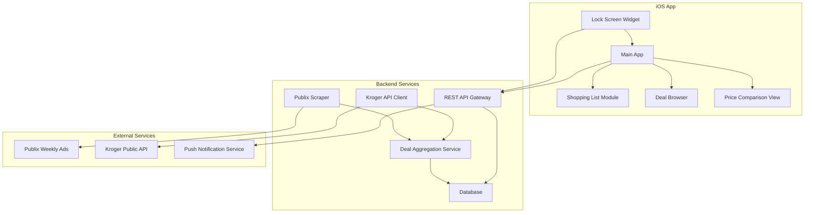

# Design Document

## Overview

The Grocery Deals App is a multi-platform system consisting of an iOS mobile application with lock-screen widget capabilities and a backend service for deal aggregation and API management. The system leverages location services, web scraping, third-party APIs, and real-time data synchronization to provide users with personalized grocery deal recommendations.

## Architecture

### High-Level Architecture



### Technology Stack

**iOS Application:**
- SwiftUI for UI components and lock-screen widgets
- Core Location for location services
- UserNotifications for push notifications
- URLSession for API communication
- Core Data for local caching

**Backend Service:**
- Node.js with Express.js framework
- PostgreSQL database for deal storage
- Redis for caching and session management
- Puppeteer for web scraping
- JWT for authentication
- Docker for containerization

## Components and Interfaces

### iOS Application Components

#### 1. Lock Screen Widget (`LockScreenWidget`)
```swift
// Widget configuration and display logic
struct DealWidget: Widget {
    // Location-based deal fetching
    // Carousel view implementation
    // Tap gesture handling
}
```

**Responsibilities:**
- Request and manage location permissions
- Fetch nearby deals from backend API
- Display swipeable carousel of store deals
- Handle widget lifecycle and updates

**Key Interfaces:**
- `LocationManager`: Handles location services
- `DealAPIClient`: Communicates with backend
- `WidgetDataProvider`: Manages widget data refresh

#### 2. Main Application (`GroceryDealsApp`)
```swift
// Main app structure with navigation
struct GroceryDealsApp: App {
    // Tab-based navigation
    // State management
    // Background refresh handling
}
```

**Responsibilities:**
- Coordinate between different app modules
- Manage app-wide state and navigation
- Handle background refresh and notifications

#### 3. Shopping List Module (`ShoppingListView`)
```swift
// Shopping list management interface
struct ShoppingListView: View {
    // List display and filtering
    // Swipe actions for add/remove
    // Category and store filtering
}
```

**Responsibilities:**
- Display and manage user's shopping list
- Implement swipe gestures for item management
- Filter items by category and store
- Highlight upcoming sales for saved items

#### 4. Deal Browser (`DealBrowserView`)
```swift
// Deal discovery and browsing interface
struct DealBrowserView: View {
    // Deal grid/list display
    // Search and filter functionality
    // Deal detail views
}
```

**Responsibilities:**
- Display available deals in organized views
- Provide search and filtering capabilities
- Show detailed deal information
- Enable saving deals to shopping list

#### 5. Price Comparison Engine (`PriceComparisonService`)
```swift
// Price analysis and comparison logic
class PriceComparisonService {
    // Multi-store price analysis
    // Best value calculation
    // Distance-based ranking
}
```

**Responsibilities:**
- Compare prices across multiple stores
- Calculate best value recommendations
- Factor in distance for store rankings
- Generate "cheapest store" tags

### Backend Service Components

#### 1. Deal Aggregation Service (`DealAggregator`)
```javascript
// Central service for deal collection and management
class DealAggregator {
    // Coordinate scraping and API calls
    // Data validation and normalization
    // Deal expiration management
}
```

**Responsibilities:**
- Orchestrate data collection from multiple sources
- Validate and normalize deal data
- Manage deal lifecycle and expiration
- Trigger data refresh cycles

#### 2. Publix Scraper (`PublixScraper`)
```javascript
// Web scraping service for Publix weekly ads
class PublixScraper {
    // Puppeteer-based scraping
    // Deal extraction and parsing
    // Error handling and retries
}
```

**Responsibilities:**
- Navigate Publix weekly ad pages
- Extract BOGO and discount information
- Parse deal details (price, dates, restrictions)
- Handle anti-scraping measures and rate limiting

#### 3. Kroger API Client (`KrogerAPIClient`)
```javascript
// Integration with Kroger's public API
class KrogerAPIClient {
    // OAuth authentication
    // Digital coupon fetching
    // Promotional data retrieval
}
```

**Responsibilities:**
- Authenticate with Kroger API
- Fetch digital coupons and promotions
- Handle API rate limits and errors
- Transform API responses to internal format

#### 4. REST API Gateway (`APIGateway`)
```javascript
// Express.js routes and middleware
class APIGateway {
    // Location-based deal endpoints
    // User management
    // Shopping list synchronization
}
```

**Key Endpoints:**
- `GET /api/deals/nearby?lat={lat}&lng={lng}&radius={radius}`
- `POST /api/shopping-list/items`
- `GET /api/price-comparison/{itemId}`
- `POST /api/notifications/subscribe`

## Data Models

### Deal Model
```typescript
interface Deal {
    id: string;
    storeId: string;
    storeName: 'publix' | 'kroger';
    title: string;
    description: string;
    originalPrice: number;
    salePrice: number;
    discountPercentage: number;
    dealType: 'bogo' | 'discount' | 'coupon';
    validFrom: Date;
    validUntil: Date;
    category: string;
    itemIds: string[];
    restrictions?: string;
    imageUrl?: string;
    storeLocations: StoreLocation[];
}
```

### Store Location Model
```typescript
interface StoreLocation {
    id: string;
    storeChain: 'publix' | 'kroger';
    name: string;
    address: string;
    latitude: number;
    longitude: number;
    phoneNumber?: string;
    hours: StoreHours;
}
```

### Shopping List Item Model
```typescript
interface ShoppingListItem {
    id: string;
    userId: string;
    dealId: string;
    itemName: string;
    quantity: number;
    priority: 'low' | 'medium' | 'high';
    addedAt: Date;
    category: string;
    notes?: string;
}
```

### User Model
```typescript
interface User {
    id: string;
    deviceId: string;
    preferences: {
        maxRadius: number;
        preferredStores: string[];
        categories: string[];
        notificationSettings: NotificationSettings;
    };
    location?: {
        latitude: number;
        longitude: number;
        lastUpdated: Date;
    };
}
```

## Error Handling

### iOS Application Error Handling

1. **Network Errors:**
   - Implement retry logic with exponential backoff
   - Display user-friendly error messages
   - Cache data for offline functionality

2. **Location Errors:**
   - Handle permission denied gracefully
   - Provide fallback functionality without location
   - Clear messaging about location benefits

3. **Widget Errors:**
   - Fallback to cached data when API fails
   - Display appropriate placeholder content
   - Log errors for debugging without crashing

### Backend Service Error Handling

1. **Scraping Errors:**
   - Implement circuit breaker pattern
   - Retry with exponential backoff
   - Alert monitoring systems on repeated failures

2. **API Integration Errors:**
   - Handle rate limiting with proper delays
   - Implement fallback data sources
   - Log API response errors for debugging

3. **Database Errors:**
   - Connection pooling and retry logic
   - Data validation before insertion
   - Backup and recovery procedures

## Testing Strategy

### iOS Application Testing

1. **Unit Tests:**
   - Test business logic in isolation
   - Mock external dependencies (API clients, location services)
   - Test data transformation and validation

2. **Integration Tests:**
   - Test API communication end-to-end
   - Test location services integration
   - Test Core Data persistence

3. **UI Tests:**
   - Test widget functionality and user interactions
   - Test navigation and state management
   - Test accessibility compliance

4. **Widget Testing:**
   - Test widget lifecycle events
   - Test data refresh scenarios
   - Test different screen sizes and orientations

### Backend Service Testing

1. **Unit Tests:**
   - Test individual service components
   - Mock external APIs and databases
   - Test data parsing and validation logic

2. **Integration Tests:**
   - Test database operations
   - Test external API integrations
   - Test scraping functionality with mock pages

3. **API Tests:**
   - Test all REST endpoints
   - Test authentication and authorization
   - Test error handling and edge cases

4. **Performance Tests:**
   - Load testing for API endpoints
   - Memory usage testing for scraping services
   - Database query performance testing

### End-to-End Testing

1. **User Journey Tests:**
   - Test complete deal discovery flow
   - Test shopping list management
   - Test notification delivery

2. **Cross-Platform Tests:**
   - Test iOS app with backend services
   - Test data synchronization
   - Test real-time updates

## Security Considerations

### Data Protection
- Encrypt sensitive user data at rest using AES-256
- Use HTTPS/TLS 1.3 for all API communications
- Implement proper session management with JWT tokens
- Hash and salt any stored user credentials

### Privacy Compliance
- Implement location data minimization
- Provide clear privacy policy and consent flows
- Allow users to delete their data
- Avoid storing unnecessary personal information

### API Security
- Implement rate limiting to prevent abuse
- Use API keys and OAuth for third-party integrations
- Validate and sanitize all input data
- Implement proper CORS policies

### Mobile Security
- Use iOS Keychain for sensitive data storage
- Implement certificate pinning for API calls
- Obfuscate sensitive code sections
- Regular security audits and dependency updates